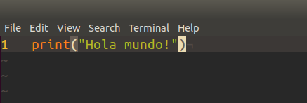
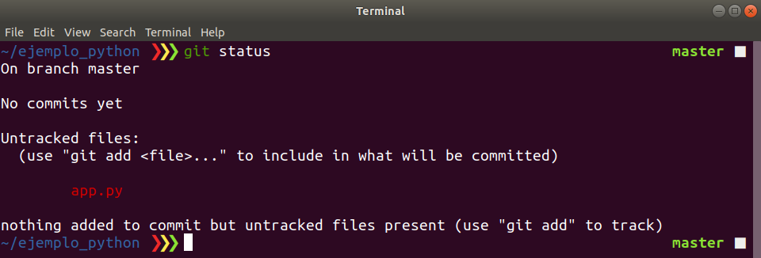
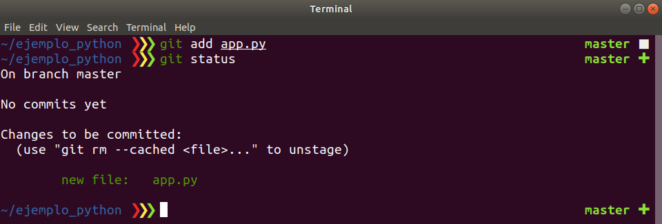
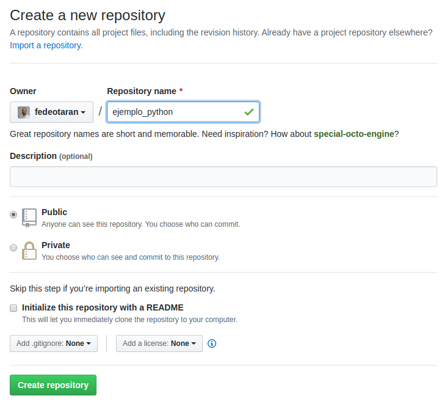
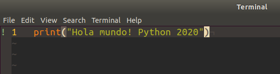

Guía de Git
===========

En la explicación práctica hablamos sobre los conceptos de git. Aquí están las
[diapositivas](https://docs.google.com/presentation/d/1pQyjBfV_tz7M2PCS3nvcnHsRaJmJaWhbYeIzzddTfVA/edit?usp=sharing).

## Instalación

!!! warning
    Tener en cuenta que esta guía de instalación de git no hace falta si se
    utilza la máquina virtual que entregamos en la cátedra para trabajar dado
    que tiene todo instalado.
    La máquina vistual la pueden descargar desde [aquí](https://catedras.info.unlp.edu.ar/mod/url/view.php?id=24366)

### En Debian-based

```bash
sudo apt update
sudo apt upgrade
sudo apt install git
```

### En Red Hat-based

```bash
sudo yum upgrade
sudo yum install git
```

### En MacOS

```bash
brew install git
```

### En Windows

Descargar en instalar de [gitforwindows](https://gitforwindows.org/) o de
[git-scm](https://git-scm.com/download/win). Tener en cuenta que en la cátedra
vamos a utilizar `GitBash` por lo cual deben asegurarse que se instale.

## Crear una cuenta de Github

Para crear una cuenta tienen que entrar a la
[web de Github](https://github.com/) y regitrarse (Sing up).

## ¿Cómo usar Git?

Vamos a ver dos formas para comenzar a trabajar con `Git`:

- Creando un repositorio desde cero y agregando los archivos iniciales.
- Descargando un proyecto ya creado y modificarlo.

### Configurar información en Git

En git cuando se va a realizar una operación para generar una nueva versión del
código es necesario contar con información de usuario. Por esto es necesario que
configuremos lo siguiente:

```bash
$ git config --global user.name "John Doe"
$ git config --global user.email johndoe@example.com
```

Para ver la configuración:

```bash
git config --list
```

### Comenzar un repositorio desde cero

Con git podemos versionar cualquier directorio/carpeta donde comencemos nuestro
proyecto. Por eso en primer lugar lo que vamos a hacer es crear un directorio.

```bash
mkdir ejemplo_python
```

El paso siguiente es moverme dentro del directorio para comenzar a trabajar.

```bash
cd ejemplo_python
```

Ahora vamos a inicializar nuestro directorio como un directorio versionado por
`Git`.

```bash
git init
```


Podemos ver que se creó en este directorio una carpeta oculta con el nombre
`.git/`. Esto significa que este directirio está habilitado para ser versionado
con `Git`. Ya estamos listos para crear nuestro primer archivo.

```bash
vi app.py
```



Guardamos el archivo en el directorio de nuestro proyecto.

!!! warning
    En este caso utilizo el editor de texto vim. Les recomendamos que utilicen
    otro editor para trabajar como VsCode, Atom, SumblimeText, PyCharm, etc.

Ahora si ejecutamos `git status` vamos a ver que `Git` detecto que hay un nuevo
archivo que aún no está versionado en nuestro directorio.



Para agregar este archivo al versionado de `Git` debemos hacer:

```bash
git add app.py
```

Volvemos a ejecutar el comando `git status` para ver que información nos da
`Git` ahora de este archivo.



Para hacer estos cambios efectivos es necesario crear un commit.

```bash
git commit -m "Creación de archivo inicial :smile:"
```

!!! warning
    Si tenemos una instalación nuevo de Git el sistema puede solicitar que
    configure mi nombre y mi mail para poder agregar esta información en el
    commit:

    Lo que tenemos que hacer es ejecutar los comandos que nos sugiere pero con
    nuestros datos personales. Esto es simplemente para que queden nuestros
    datos asociados al commit como autores.

En este momento tenemos el primer commit en nuestro repositorio local.
Podemos ver la lista de todos nuestros commits con el comando `git log`.


Ahora queremos compartir nuestro código y para esto es necesario subirlo a un
repositorio remoto. Para esto es necesario [crear un nuevo repositorio en
`Github`](https://help.github.com/es/enterprise/2.17/user/github/getting-started-with-github/create-a-repo).

!!! warning
    Tener en cuenta de **NO CREAR** el archivo `README.md` como sugiere la guía
    ya que va a complicar el subir nuestro código.

    

Una vez creado el repositorio en `Github` tenemos que agregar ese repositorio
remoto en nuestro repositorio `Git` local.

```bash
git remote add origin git@github.com:fedeotaran/ejemplo_python.git
```

Ahora ya estamos listos para subir los commits con nuestros cambios.

```bash
git push -u origin master
```

La salida de comando debería ser parecida a esta:


Ahora nuestro código ya esta subido al repositorio.

### Comenzar desde un reposotorio ya creado

La sección anterior nos explica como crear un nuevo repositorio de `Git`, pero
cuando estamos trabajando en equipo es necesario que **sólo una persona**
realice la creación del repositorio. El resto de los miembros del equipo tiene
que realizar la descarga del repositorio y comenzar a trabajar.

Para esto es necesario usar el comando `git clone`.

```bash
git clone https://github.com/<username>/<reponame>.git
```

En mi caso para el repositorio que acabo de crear sería:

```bash
git clone https://github.com/fedeotaran/ejemplo_python.git
```

Esto va a generar una nueva carpeta donde descargará el contenido del
repositorio. La carpeta se creará en el directorio en donde estemos parados
a la hora de ejecutar el comando `git clone`.

!!! info "¿Comó descargar el repo con otro nombre?"
    Si queremos que la carpeta que genere sea con otro nombre distinta a la del
    repositorio hacemos:

    ```
    git clone https://github.com/fedeotaran/ejemplo_python.git otro_nombre
    ```

El repositorio desgargado ya tiene toda la información de `Git` para comenzar.
No es necesario hacer el `git init` dado que el repositorio ya creó otra
persona.

Ya estamos listos para comenzar a trabajar o continuar el trabajo. Nos movemos
dentro del directorio.

```bash
cd ejemplo_python
```

Vamos a modificar el archivo `app.py` que generamos anteriormente.

```bash
vi app.py
```



Y ademas vamos a crear un nuevo archivo `README.md` para agregarle documentación
a nuestro proyecto.

```bash
vi README.md
```


Ahora si ejecutamos `git status` veremos cuales fueron las modificaciones que
aplicamos a nuestro repositorio local.


Para sumar estos cambios a git ejecutamos `git add`.

```bash
git add .
```

!!! info
    Recordar que con `git add .` lo que hacemos es agregar los cambios que
    hicimos para todos los archivos

Una vez que tenemos listos el grupo de cambios y queremos versionarlos creamos
un nuevo commit.

```
git commit -m "Modifico app y creación de README para documentación"
```

Ahora vamos a subir nuestros cambios.

```bash
git push origin master
```


!!! info
    Tener en cuenta que no es necesario subir cada un commit, podemos acumular
    localmente una serie de commits para luego aplicar los cambios en el
    servidor

Ahora el servidor ya tiene nuestros nuevos cambios.
